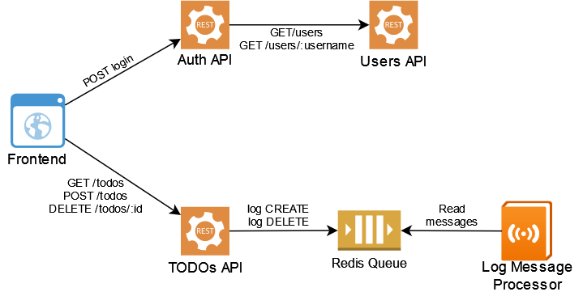
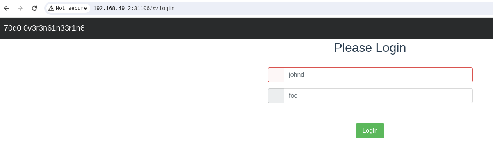

# Helm with microservices

Practica # 1

En esta practica, se desplegara una arquitectura de microservicios llamada todos-api, las imagenes de los microservicios ya estan previamente creados

  

Se usara una implementacion de helm por cada microservicio, en total entonces seran 7 microservicios comunicandose entre si, aparte de ello, cada uno tendra la siguiente estructura

    ├── microservice-name
    │   ├── templates
    │   │   ├── deployment.yaml
    │   │   ├── service.yaml
    └── Chart.yaml
    └── values.yaml

Existen dos formas de generar dicha arquitectura, una forma manual y otra creada por helm automaticamente

## Forma Manual

Primero crearemos la carpeta con el nombre del microservicio, usaremos de ejemplo al frontend

    mkdir frontend
    cd frontend
    mkdir templates
    touch Chart.yaml values.yaml templates/deployment.yaml templates/service.yaml

## Forma automatica

Con el comando

    helm create frontend

Se creara toda la estructura necesaria pero se añadiran mas archivos que puede no ser de utilidad y ademas, añadira un codigo de ejemplo que luego tocara eliminar por lo que el trabajo final puede ser un poco mayor a la creacion manual

# Explicacion de cada archivo contenido en helm

Podemos apreciar que contamos con 4 archivos .yaml

## Chart.yaml

Aqui se encuentra la informacion de este chart o paquete, el nombre, el autor, etc

## values.yaml

En este archivo se encuentran los valores de las variables que son usadas en el despliegue y en el service de la aplicacion, ten en cuenta que todo un chart de helm, es decir, toda la carpeta por ejemplo frontend se puede comprimir y se creara un .tar, este archivo luego puede ser instalado por otra persona y dicha persona, al no ser la autora del projecto o el chart solo tendra acceso a modificar los valores de values.yaml, los valores de chart, deployment, service y demas, solo seran visibles para el creador del projecto.

## deployment.yaml y service.yaml

Esto funciona con kubernetes, es decir, el despliegue y el servicio se encuentran en estos archivos, las instrucciones, nombre de contenedores, replicas de pods etc estan contenidas en estos dos archivos

# Despliegue del chart

Cuando ya tenemos todo listo en nuestros archivos podemos desplegarlo usando el comando

    helm install frontend ./frontend

Esto creara un char con el nombre frontend que se puede ver usando

    helm list

Tambien creara un pod y un servicio con las replicas que hayamos definido que se pueden visualizar con el comando

    kubectl get all
    kubectl get pods
    kubectl get services

# Prueba de la aplicacion

Cuando ya hemos desplegado todos los charts que en realidad son todos los microservicios necesarios para la aplicacion, se puede probar ingresando al puerto del frontend, en este caso, al usar minikube se accede de la siguiente forma

    minikube ip

Luego se toma la ip del cluster y se accede mediante el puerto del frontend

  

  

Se accede con las credenciales admin admin

